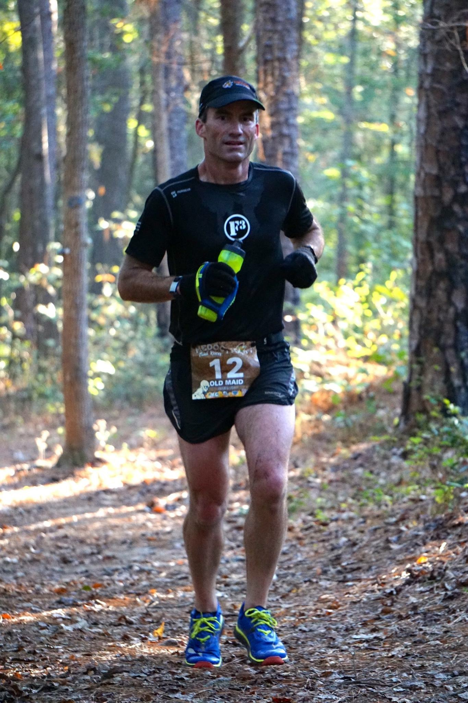

Writing a bit of a backblast from some solo work this past week, and some observations along the way.

Will spare you the backstory, but needless to say, I'm on the disabled list for a while.  This photo is from lap one or two, "Before the Fall".  Left knee's pretty useless at present.  So it's giving me a chance to see things from a different perspective.

**Inclusive**

YHC rolled in to Bond Park about 5:05:20 on Wednesday, to see the Insomniacs all flying around the corner, then to see Bartman and his merry band of Ruckers heading out as well.  Alas, a little solo sojourn for Old Maid.  As I planted the newly-refurbished Insomnia/Vesper shovel flag, I look up to see Bartman, PBX, and Term Paper circling back to pick me up.  Y'all don't even know.

So I strapped on my internal-frame backpack full of 4 BMW subframe bushings (yep, they're pretty heavy), a cast iron frying pan, and its lid, and set out with/behind them.  And we rucked around for the better part of 40 minutes, covering some good ground and having some great 2nd F along the way. We headed back to the flags as the rest of the PAX rolled in for the main event (more running in multiple directions, and a tractor pull with Riptide's sleds).  And me.  With the bum leg.

This time, I was on my own.  I covered some of the same ground, but mostly different, and this time was able to spot the PAX doing their thing together.  Riptide extended a friendly hand to come be the ballast on the sleds (politely declined), and as I was circling the lot the herd grabbed their sleds and departed.  Figuring it was about time to head back for COT, I headed back towards the flags, but not before heading up towards High House to see the incoming Vesper runners on their way back.  Powerful effort to finish up that hill for all, but Sky Blue was out in front and King of the Hill.

Then everyone gathered back up with flags flanking on either end, and the large group shared their joys and concerns, praises, and prayers.  I strangely felt like an outsider looking in, even though I started with you all, and finished with you all.  It was very unusual.  Then it hit me.  I missed everything in the middle.  It was like reading the first and last page of a book.  I knew how it started.  I knew how it ended.  But I missed the whole story.

**Awesome**

When y'all form up and head out, it's powerful.  The ball of men that go off with their leader is inspiring.  Today I was back at it out at Dante's Peak, arriving with the PAX, but then watching their dust as they departed with Disco Duck.  Hotspot asked if I was going to be back for COT; "Yep!" I promised.

Caught up with the PAX as they warmed up on the basketball court, then I continued my sojourn up Evans Rd hill to the corner for some ruck merkins, then down the hill doing Sir Fazio arm circles (50 each direction), until I decided to follow the path behind the tennis courts, then blazed a trail down there where we normally go left towards bear crawl bridge.  I kept plugging along until I found the Pine Loop (0.5 mile) through the woods, where I then found the Holly Loop (0.7 miles) but found myself lost in the woods  (funny how that works) at 6:20.  The trail just ended-but it was supposed to be a loop!  I backtracked until I found one of the disc golf baskets (#16) then knew where I was, bushwhacked past 4 sleeping-now-awake deer, up to catch-me-if-you-can lake, and found that I was going to need to **RUN** to make it back for COT.  So I did the best I could (looking at Strava, I got to a blistering 10:50/mile for about 100 feet).  It hurt.  More than I thought it would.  Got there just as Monkey Nut was finishing leading the PAX through Mary of Windshield Wipers.

I was outside the circle for count-a-rama and missed it as it came by, but chimed in as #20, and got invited to the table.  I took in the announcements, concerns, and selfishly asked God silently to help heal me as well.  In the hubbub I neglected to mention prayer requests for my M with a broken left foot, and 2.0 DeNiro with a broken left arm (playground injury).  Yes, it is my left knee that is torn up.  Good thing the three of us are right-side dominant!  It was also very nice of Earhart to come up afterwards and welcome be back to DP, after a long absence.   Blue and Out also shared condolences on my injury, as did Disco Duck.  Hotspot again poked me to share the "before stitches" pic, but that's not necessary.  Suffice it to say I think some volunteers at Medoc won't be able to unsee what they saw.

 

Carpex is the best.  You don't get this camaraderie everywhere.  For a dude who grew up as an only child (still am), I hope the brotherhood we share in F3 is what my 2 sons grow up sharing (right now they just want to pi$$ each other off all the time).

So, for the next little while, I'll be behind the 6, keeping my eyes out for you all.  Know that I want to be there in the middle with y'all.  But I'll be there if you need me.

Old Maid
