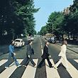

This a story about when 21 men went to a park.  Not just any park, the best park in CARPEX.  It all started the night before, when PBX encouraged everyone to roll up, roll up for a Magical Mystery Tour.....here's what happened:

## Warm Up:

```
545 - Warm up run to near soccer pitches and oval up for 15 Good Mornings; 20 Cotton Pickers; 20 mountain climber; 20 plank jacks; 20 Hillbillies
```

## The Thangs

```
Mosey to Soccer fields - starting at near goal line - and Partner off - size and speed matter         
Wheelbarrow to half way line & flapjack; Squats until everyone back then repeat-o Wheelbarrow-o; People's chair until all back
Bear Crawl to 18 yd line; Run to half way; Bear Crawl to far 18 yd line;  Run to goalline; Plankhold at far end of pitch
Crawl Bear to 18 yd line; Backward Run to halfway; Crawl Bear to 18yd line; Backward Run to goalline; lbc's until everyone done   

BTTW - until everyone done & recover with run to lower crosswalk.

P1 - merkins AMRAP until P2 returns. 
P2 - run to rock pile, collect travelling rock & return carrying Rock above head.  

P2's backward run ALL the way up the hill, ABBEY ROAD the top crosswalk (both ways), run down hill.
P1's Rock Run - run with rock to basketball court, 20 rock curls + 20 rock presses & run back.
Meet your partner & flapjack.
             
P2's backward run up hill to service road only, ABBEY ROAD both ways and run back down hill.
P1's Rock Run - run with rock to basketball court, 20 rock triceps + 20 rock rows & run back.
Meet your partner & flapjack.

P2's backward run up hill to service road only, ABBEY ROAD both ways, run back down hill.
P1's Rock Run - run with rock to basketball court, 20 rock curls + 20 rock presses & run back.
Meet your partner & flapjack.

Return Rocks & Mosey to Basketball court for Mary - 20 LBC's and done.
```

## COT

```
Announcements – Dee Dee's 5k Saturday 6/24; FIA launch 7/22; check the chronicle for all latest news
Prayers – Goose's son Cam who is still in hospital.  All unsaid prayers & praises.

It was a pleasure & privilege to lead you men this morning...
```

## NMS

- Great running in this morning with Ma Bell, and glad he didn't make us stop for Merkins on the way.
- Swag gives a great disclaimer - no one could ever consider legal action after Swag's convincingly comprehensive disclaimer.
- Thanks to Vortex and Hope Solo for visiting & bringing FNGs - welcome Big Red & Wannacry.
- Biner is part wheelbarrow, part cyborg.
- Advance happy birthday to Sooey and Sooey's 2.0 who both share a birthday with YHC this Thursday (6/22).
- PAX were a little rambunctious around the wheelbarrowing fun today.
- Kilmer who on the long-long-long backward run, said, with meaning, those three little words...."I hate you".  This is the premium complement a Q can receive.  Thanks Kilmer for awarding me this prestigious honor.
- After PBX's Magical Mystery tour tweet, and our Abbey Road Lunges, it seems right to finish this BB on a Beatles theme (with apologies to Lennon/McCartney) - _What would you do if I Q out of cadence?  Would you stand up and walk out on me? Lend me your ears and I'll Q you a workout and I'll try not to Q out of Cadence....Oh, I get by with a little help from my friends........_


