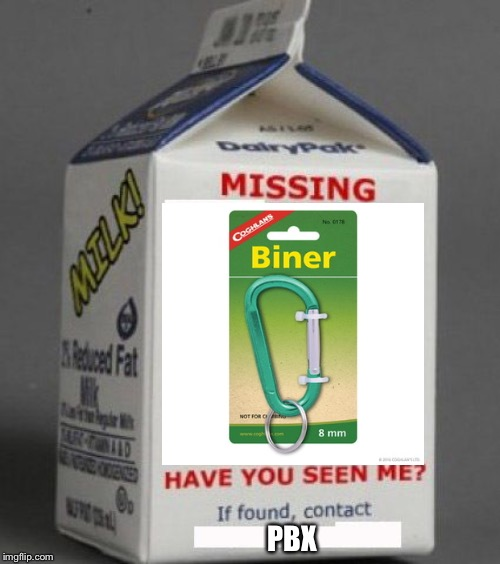

This morning, before we kicked things off, Red Ryder was sharing his feelings with the PAX eagerly awaiting the start of YHC's beatdown when PBX interrupted with the title exclamation, "Where the F\*ck is Biner?"  
Needless to say, Red Ryder was upset he didn't get out all his feelings, but everyone's attention was now solely focused on theories as to what happened to Biner and where he might be? Everyone had their own take on what happened, but eventually it was 0530 and time for the pledge.

  
**Warmup**: No FNGs, so short disclaimer disclaimed, pledge pledged and off we go. YHC led the PAX the long way, across the entire upper parking lot to the front of the church where we circled up for the warmup.  
SSH x15 IC  
GM x 6? IC  
Sir Fazio Arm Circles fwd/rev x10 IC each way  
Seal Claps x10 IC  
Daisy Pickers x10 IC  
Plank Jacks x10 IC  
Calf Stretch L/R x10 silent count  
That's enough warmup. Off we head to the covered drop-off area around the side of the church.  
**Thang 1:** Partner up for a Dora 1-2-3. With your partner complete the following:  
100 Merkins  
200 Jump Squats  
300 Heels to Heaven (switched to LBCs for last 100 as it was taking a bit longer than calculated.)  
When not performing exercises, other partner runs the drop-off pickle.  
**Thang 2:** Mosey to the far corner of the parking lot and keep the same partners for some double 11s.  
Top corner: Steve Earles  
Side corner: Burpees  
When you meet your partner in the middle, Booyah! Merkins.  
Decrease the number of reps in each corner starting at 10 and increase BMs by 1 each time. We ran out of time, but were able to get to 5 in the corner and 6 BMs. Mosey back to the flag just in time for COT.  
**Count-o-rama:** 9 PAX (still no Biner)  
**Announcements**: Trip to Burgaw 3/21. Post at HT if you can. Maynard this Saturday, 0600 launch. All paces welcome.  
**Prayers:** Kristen- Pancreatitis, Bonnie- surgery today, Barbara- undergoing treatment for cancer I believe?, Asher (YHC's 2.0) battling ear infection (#3 this year) and pneumonia.  
YHC took us out.  
**NMS:** YHC ran in from home plus some extra to hit 6 miles total today per his 1/2 marathon training plan. Thanks for the encouraging words from everyone. 3 PAX for ECP- well done gents.  
It's not very often I post (or Q) with single digit PAX, but it's really nice when you leave knowing you had a chance to interact with each person on some level.  
As always, thanks to everyone who showed up for coming out to my Q. I appreciate the opportunity to lead. I hope you all had as much fun as I did, even though there was a little rain. MIAGD!
