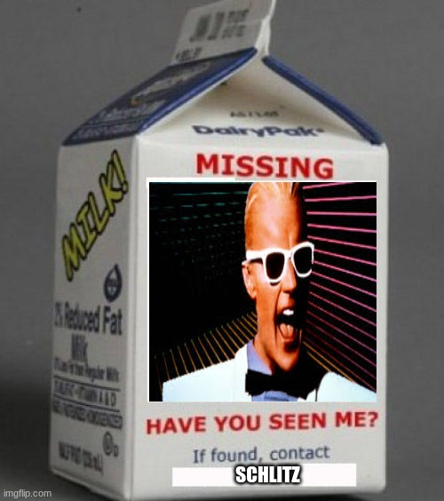

Well, Headroom was on the Q sheet for this morning's workout. 0530 came and went and there was no Headroom and since fellow site Q Chicken Little was at A Team with the rest of the boy band, YHC had to fill in. Headroom, you owe us one buddy!

**Warmup:** Ok, so YHC is leading this thing with no plan whatsoever and someone suggests we mosey around the parking lot to see if Headroom does indeed show so that sounded like a great idea. Mosey to where the flag used to be planted and circle up for:  
SSH x 15 IC  
Good Mornings x 5 IC  
Sir Fazio Arm Circles fwd/rev x 10 IC  
Seal Claps x 10 IC  
Imperial Walkers x 10 IC  
Plank Jacks x 10 IC  
Calf Stretch L/R x 10 silent count each side

**Thang 1:** So during the warmup I decide we're going to head towards the track. Smaller group and a couple of Pax had never been to the AO before so I might as well give them a tour. We take the route in front of the schools so we can stop by the "half balls" by the middle school for 2 rounds of Derkins, Irkins (x10 each) and L/R step-ups (x20 IC).

**Thang 2:** Once finished with Thang 1 we complete our mosey to the track. Start on the track near the gate with 5 burpees. Mosey 1/4 way around the track and add 10 merkins to the burpees. Another 1/4 mosey and add 15 jump squats. Another 1/4 mosey to add 20 LBCs IC before moseying back to start.  
We perform a second lap in the same fashion with 5 Turkish Get-ups, 10 Bonnie Blairs (L/R = 1), 15 Crab Cakes (L/R = 1), and 20 leg lifts.

**Thang 3:** A rare opportunity for a thang 3 from YHC. Indigenous Peoples Run behind the schools to the top of THE hill in front of the high school for 7s. 1 merkin at the top, 6 Steve Earle's at the bottom. Almost got them all in before heading back to the flag for Mary.

**Mary:** Homer to Marge (x10 IC), Low slow flutter (x10 IC), American Hammers (x10 IC) and (slow) 100s. Have a nice day!

**COT:** Announcements- coffee at Viscious fishes immediately following.  
Prayers/praises- great job to all those that ran the Maynardino this weekend. Prayers for all those recovering from illness and surgeries. YHC took us out.

**NMS:** While I wasn't excited the scheduled Q didn't show this morning, it did give me the opportunity to lead the men. I have admittedly not been Qing as much this year and I felt good being able to put on a seemingly challenging beatdown on the fly. So I guess in a way, thanks Headroom. But you still owe us a Q. MIAGD!
