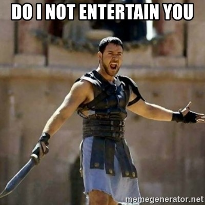

YHC had the alarm set for 5:00 sharp this morning...but hit the snooze once and rose from the fartsack at 5:08 after convincing myself to get to Wolverine today. As I exited the house, I pulled up the Q sheet to see who was going to lead this beatdown...I was just glad it wasn't me today!

<figure>

<figcaption>

**Oh Sh\*t!!**

</figcaption>

</figure>

With approximately 4 minutes of prep time, we are off!

- **Warm-Up**
    - Brisk jog down the path to the parking lot
    - Hit the lines
    - Circle up
        - SSH
        - Poorly executed cadence for Hillbillies....screw that, let's do some merkins!
        - Back to SSH
- **Thang 1**
    - Partner up for an on-the-fly new version of 7's!
        - 1 Burpee in the field, partners go in opposite directions for a run, 20 LBC's where you meet. Back to the run to where you started, increase burpees by 1 until you get to 7.
- **Thang 2**
    - We line up heaviest to lightest, break up into groups of 5
        - We start with 20 WW2's, then a 5-PAX carry across the width of the soccer field, 20 more WW2's.
        - Carry the next person back, 20 merkins, etc.
        - Last set is with flutter kicks.
- **Thang 3**
    - Same groups of 5, we run across the soccer field and back.
    - First volunteer does 10 Australian Pull-ups with PAX holding arms and legs.
    - Repeat run and APU until all PAX in team complete.
- **Mary**
    - Run back to basketball court, on the 6 and feet at 6 inches until the 6 arrives. Hold 'em up
    - Flutter Kicks. Hold 'em up
    - Hello Dolly's (Hey girl). Hold 'em up
    - Mosey to flag
- **COT**
    - Meh - 15
    - Respect - 5
- **NMS**
    - Our Site Q Pivot was late...no pledge. Thankfully he did show up, and thankfully he and his 2.0 are not hurt after an accident the day before. Pivot, please make sure that you turn the alarm up on the new phone tomorrow!
    - YHC apologizes about the unplanned workout, but I hope everyone got a good sweat, and I hope you were entertained!!

