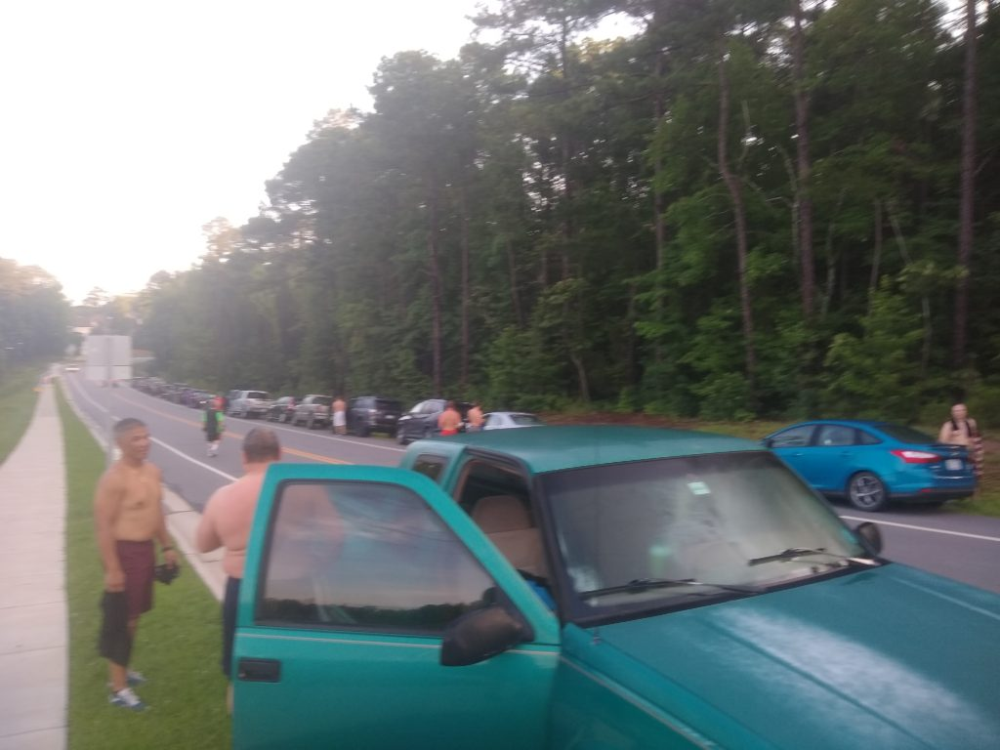
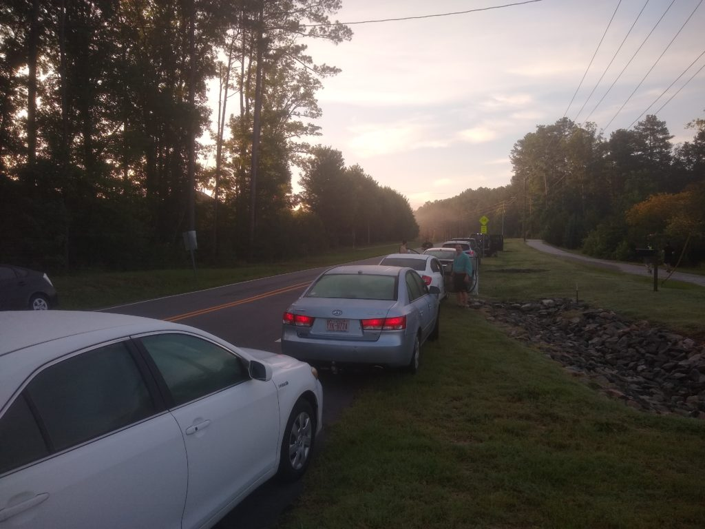

## The Back Story

After fifteen hours of rain from Tropical Storm Elsa, the skies parted and left a beautiful Carpex just ready for something special – YHC's first Q. And what an auspicious occasion it was! I knew I took a long time to finally get to this place and there were a lot of guys that encouraged, pushed, and flat-out razzed me to get here. Thank you all for that. I needed it.

I knew I needed to bring something good as I took way too long to take a Q; so I started to look for inspiration. I found it in the form of an artist that I think we can all agree is an American treasure, [Uncle Kracker](https://www.unclekracker.com/).

Kracker covered Dobie Gray's 1973's hit, _Drift Away_ back in 2002.He didn't just cover it though; he made it into a duet.

https://www.youtube.com/watch?v=A69BertdSt4

You see, Uncle Kracker really liked this song and although it was a hit for Gray, he felt like it never really got its proper accolades.

I too had this same feeling about an experience I had a while back in Carpex. I decided to reenact a substantially similar Q to that of my man [Pom Pom](https://f3carpex.com/tag/pom-pom/) from a while back that I really liked. It was maybe my favorite Q ever, I was completely gassed afterward, it went by in no time, and I was pretty beat up for the next few days. For me, that's a win. I really felt like we'd be talking about this more but, alas, we did not.

So, I sought out his guidance and he was all too happy to oblige. It was really a duet but he's not one to steal the limelight. I made some tweaks to it like any good chef does with a recipe but make no mistake, he was the inspiration for all of this. He also showed up early to help me set up and give me moral support. Under his tutelage we came up with what I'm affectionately referring to as a "**Ro Sham Bolton**" (it's a working title).

The crew that showed up was healthy and Apex Barbeque Rd was looking tight. Apologies for the poor image quality. My phone was pretty sweaty:

- 
- 

### Warm-UP

To my detriment, we didn't do a whole lot of warming up because I wanted to get right into it. We started with the Pledge and a very short warm-up consisting of good mornings, arm circles (forwards and backwards), and a quick mosey to the fields where the stage was set for mayhem, mumble chatter, and lots of smiles.

### **THE** Thang

The field was set up with 7 pairs of cones, 6 along the perimeter and 1 along the midfield line. We congregated in the center of the field to hear the rules:

1. Everyone heads to the sidelines, anywhere they want. When the music started (the music was totally dope BTW), start running along the line in the direction of your choice. You may cut across the field whenever you reach the midfield line but you must keep moving and you must stay on the line.
2. When you come upon a fellow PAX, you Ro Sham Bo. Best out of 3 take it. The winner continues on his way. The loser chooses from 2 burpees, 4 merkins, or 6 squats.
3. If you pass someone, tap them on the shoulder and they must choose from 2 burpees, 4 merkins, or 6 squats.
4. When you reach any cone, you must do the exercise written on the paper taped to that cone until you hit it's a partner cone. Doodles and caricatures supplied courtesy of my 2.2. Exercises between the cones consisted of:
    - Frankensteins
    - Spiderman crawls
    - Frog hops
    - Foxholes
    - Apolo Ohnos
    - Merkin rolls
    - El Capitans

5. If you are engaged in a penalty or between the cones you cannot be penalized for being passed and you don't have to stop to ro sham bo.
6. \[Unspoken rule\] Hitting someone right out of a penalty or the cones is poor form. Don't be that PAX.

This quickly became a game of spy vs spy for many who were stalking one another in an effort to catch their fellow PAX and drop them for a penalty.

_\[Audible\]_ For the last 10 minutes, the penalties doubled.

### COT

**Count-a-rama**:  37

**Name-a-rama**:  1 Honor, 11 RESPECT, 24 meh, 1 HATE

**Prayers / Praises**:  Prayers offered for our brothers in **[Hickory](https://f3foothills.com/)** for the sudden loss of one of our PAX (Dilbert) for [Track Star's](https://f3carpex.com/tag/track-star/) wife's friend in her personal difficulties, for [Tang](https://f3carpex.com/tag/tang/) and his family while he's deployed. We also pray for [WWW's](https://f3carpex.com/tag/www/) family's safe travel tomorrow and praised his brother's retirement from the Armed Services.

**BOM**:  YHC took us out

### NMS

- Not every PAX is all about the running as much as they may say they are. There were too many smiles and too much laughter to disprove that.
- There's a direct correlation between the number of PAX that will show up for EC and the amount of perceived dislike of running the QIC has.
- When doing things like Foxholes and Merkin Rolls, cones should not be any farther than 20 feet apart or you risk nausea and, potentially, a merlot.
- [Spicoli](https://f3carpex.com/tag/spicoli/) is capable of running **_REALLY_** fast if properly motivated. Thus far, that motivation consists of creeping up on [Bolton](https://f3carpex.com/tag/bolton/) to tap him on the shoulder while passing him.
- [Crimson](https://f3carpex.com/tag/crimson/) always throws paper first.
- [Pivot](https://f3carpex.com/tag/pivot/) is disturbingly good at Frankensteins.
- [Biner](https://f3carpex.com/tag/biner/) is able to do Merkin Rolls on a wet field without getting wet.
- [Shut-In](https://f3carpex.com/tag/shut-in/) wound up making an appearance at the very end which just goes to who you that a Nantan never really stops supporting his PAX. Thanks for that.
- The little black rubber bits on turf fields are called "crumb rubber" and will hereafter be rereferred to as souvenirs since they are the gift that keeps on giving. My apologies to all of your M's for those souvenirs all over your houses. :-)
- 36 PAX is not easy to manage so the fact that this post didn't completely devolve is a testament to how much they all wanted it to work. Thank you for playing the game and for pushing each other. So far, the feedback has been really positive.

##### Bolton: Out
