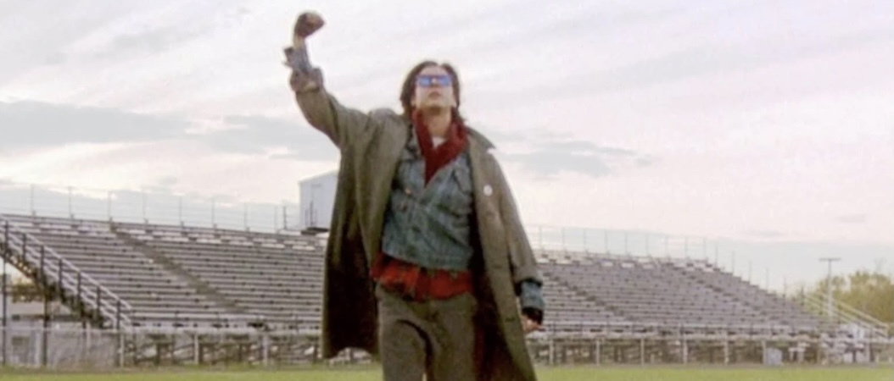

- 

2 1/2 years ago Pickles approached me with an idea to start a second limited run AO in Carpex. I was months behind on my membership dues but Pickles promised that he could "fix it" with the Leadership if I became a co-Site Q and started paying him directly in unmarked $10s and $20s (privilege of him being the Dues Collector, I guess).  

At first, I was worried. I was fairly new to F3 and unlike Mama's Boy people actually liked me after their first post with me. Site Qs are typically chosen from the PAX that are deemed butt-faced-jerks-with-too-much-mumble-chatter-and-not-enough-baby-batter. But Pickles swore if I showed up sober, relatively on time, and showed leadership I might get demoted to the role of Carpex Comms. But from there I could move out of the state with my head held high and my dignity mostly intact.

So it was with a heavy heart that I pulled into the Claymore site at 5:44:21 on the final day of my Site Q duties. I had shown up early to thank Pickles for getting me involved in with the AO before anyone else showed up but 1) apparently it is not a 5:54 am start yet and 2) the edges of the Claymore shovel flag has dulled too much for thanking him properly so instead I just planted it and joined the circle of mostly awake PAX.

Here is what went down instead:

Warm Ups:  
Pickles and I had coordinated the entire event extensively. Unfortunately, we hadn't realized we were choosing the same warm up exercises (or maybe that's what he meant by "No, you need your own list of exercises, Frisco. You can't just copy mine.")

Unfortunately my weinke got soaked with sweat during the workout so I am not sure exactly what we did in warmups. Also the piece of paper I had with everything written down on it got ruined by the sweat so I can't refer to that. (See what I did there?) But I think we did every warm up exercise twice--once with Pickles, once with me.

Thang 1:  
Here is a pro-tip for all you new Qs. Pick 1-2 Thangs as a back up in case you have to do an emergency Q or if your current Thang isn't working.

Sooey uses 7s because he can fartsack them without anyone seeing it. Parker falls back on Partner Pickle Pounders (yeah, we're talking to him about that). Prodigal makes everyone eat steel cans (its a core exercise).

Mine is Doras. If you have a PAX you don't like just pair up with them on a Dora and you'll never have to talk more than "how many LBCs do we have left, DB?"

So, of course, Pickles called a Dora. We paired up in 3s and grabbed rocks for some variety.  Disco Duck kept trying to be my partne....hey wait, a minute...

1 runs the pickle, other 2 knock out curls for girls, tricep ext, and rock your body (yeah, I know.  Those three are pretty much the same thing.  Why do you think we were relieved of Site Q duty?)

Thang 2:  
I considered doing a Dora but realized I was already on Happy Gilmore's poop list for making him do two sets of Good Mornings during the Warm Up. I knew this because after the third time I ran past him on the pickle (well, maybe it was the other way around) I realized he wasn't saying I was #1 with his hand gesture.

"Blimps," Sooey whispered.

I laughed.  "Repeato and Bartman are a little porky these days, but 'blimps' is a little harsh, don't you think?"  But looking at the two of them maybe Sooey was right.  "Hey, Blimps!" I yelled over at them.  

Apparently, "Blimps" is an exercise from the lexicon though because everyone started doing burpees.  I quickly verified with Sooey what the letters stood for.

B-Burpees (10 - thanks WWW for LITERALLY counting down when I said "if you get to 10 start counting down")

L-Lunges, both legs = 1 (20)

  
I-Imperial walkers, both legs = 1 (30)

  
M-Merkins (40 -- thank Crim for the cadence count)

  
P-Hand Release Pickle Pounders (50)

  
S-Squats (both legs = 1) (60)

Mary:

We had about 30 minutes left so it seemed a good time to call Mary.  

As we got to our 6 Wahoo whispered "Too soon!"

"That's what she said," I whispered back, snickering.

"No it's too much Mary," he said.

"That's not what Riptide said," I smirked. "Wait! Wahoo, how did you get into this Back Blast," I said, questioning. "You're not even at Claymore today."

"Dream sequence," Wahoo said. "Hopefully yours. Actually, no hopefully not yours. Actually, don't ever dream up this dream again. And stop using so many present participles verbs as auxiliaries, it clutters your writing, weakens the resolve of our allies, and contributes to adult obesity." Then with a pop he disappered.

“Everyone's a critic," I muttered, muttering.

The dirty motherruckers had returned at this point and forced their way into Mary.  The rest of us tried to pretend we didn't see them but no one could pretend we didn't smell them.  Ruck-Stank...the struggle is real.  We finished up Mary and circled up for COT.

COT:

Announcements/Prayers/Praises: 16 Steves asked me to wait until his Leg Day Q so I didn't overshadow his Back Blast.  So I have no clue what happened at this point.  I know Pickles gave a 45 minute speech (which may have been longer since we left him there talking after we all left to start our mornings).  But check Slack for those days to see if anything still applies (TMFML).

NMS:

Since Pickles spoke for 45+ minutes he pretty much drained all the intelligent and moving things I had planned to say (thus the quality of this BB). But I will say it was an honor to be one of the (and probably the most important) founders of the most popular AO in Carpex--on a Tuesday or ever really.

Special thanks to the Leadership team for uncovering those photo...well, let's just say I am glad they were able to encourage Skipper to pick up Claymore for Pickles and I. Repeato is another story that guy is...I mean, and I am also glad he stepped up to take over from Pickles and I. Being Site Q at an IR can be tough. Recruitment requires you to go to other AOs and “accidentally” injure people. Is it sketchy? No more than the Bounty Hunter Site Qs hiring a Boy Band to show up at Hot For Teacher to drive down their numbers.

Let’s face it. Running AOs is meant to bring out the alpha in the PAX because that’s how we get better—by crushing the dreams and hopes of our brothers to climb over their broken, crying…wait Pickles told me to strike all of that from our speech.

Um, really great being a site Q. Glad to have made an impact. Support your brothers and vote Frisco for HOTY 2020.
