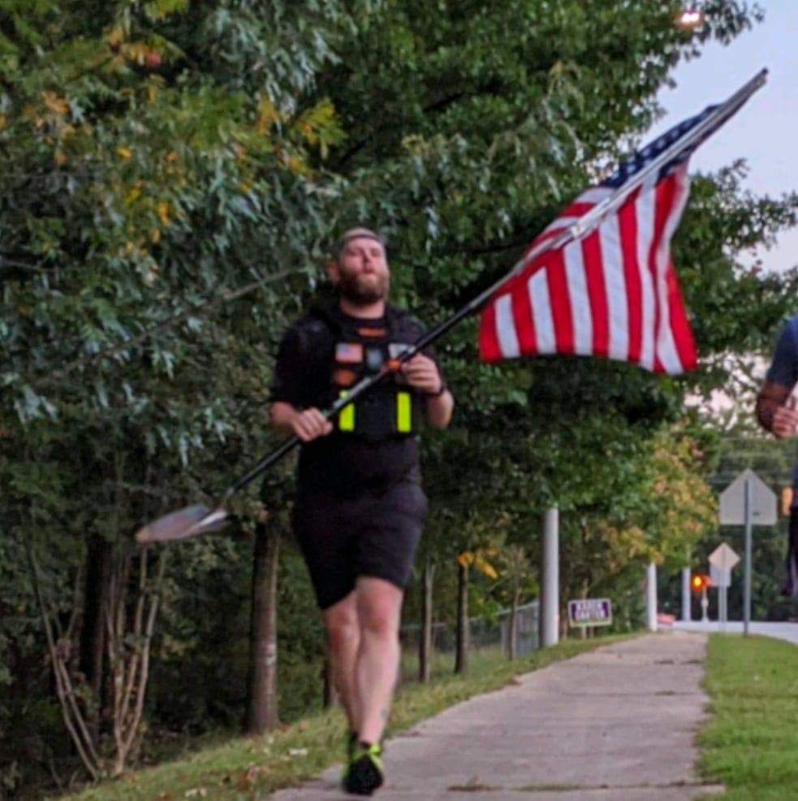
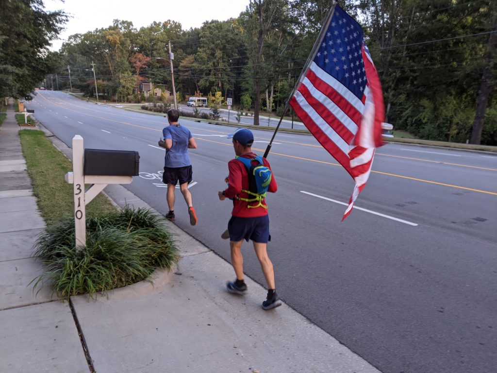
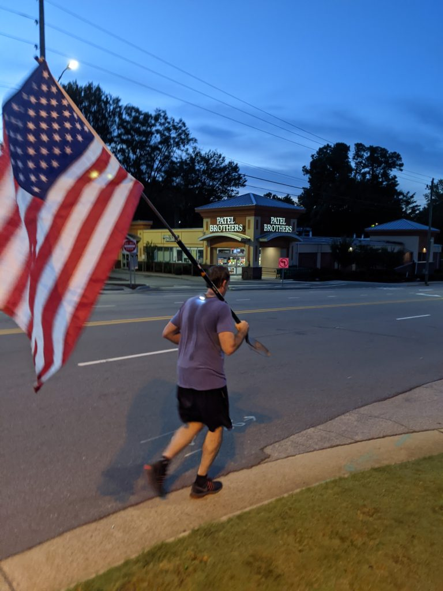

When the powers that be announced the DES challenge, I thought "I have got to get in on this!" Having something to train up for gives me more motivation than just training to train, so I could use something like this in my life.

Had a few thoughts, reached out to HIMOTY 2018 Disco Duck with a thought of tire flipping the Maynard, and his response was "literally LMFAO. Seriously? Better start training and train like a mother…." Logistics got the better of me, being that it would be possibly overnight and having to cross major roads, tired, flipping a 200 lb tire just didn't make sense. Could modify, use James Jackson 11 times, but it's not the same. (Not going to lie, still wanna do it)

I have been pushing on pull ups, so I figured a Murph would be a good thought. Hi Liter did like 190 last year, so not exactly epic, so let's add more miles. Maynard comes in again. If doing the Murph by the book, then we gotta do it all in a vest. Great, yet horrible idea, let's do it.

Kwik Stop and I have been doing at least one Murph a week, every Saturday as en EC for Phoenix for several months. Some weeks we did the IPC before the Murph, some days we did a second Murph, many days I regretted the decision because of temporary pain, but the whole adage of "what doesn't kill you makes you stronger." Adding in some weighted runs were as fun as expected, but gotta put them in. Ran the Maynard a few times with the vest, smaller loops, all the same, all horrible. 

3 October, at the community center at Bond Park, it was time. It was decently warm that morning, and I got up stupid early in anticipation and to drop water at the tower.  Had 5 other guys out there for the run, Texas Ranger with his V-Maynard, Banjo with his millionth (I dunno, still seems low) ran the normal way with me, slow pace, carrying the Phoenix shovel flag. Schlitz, Pierogi ran it backwards, with Laronda and his V-Maynard as well. Those backwards guys crushed it, sounded like they were chasing LaRonda and his superhuman speed. We ran a sub 11-minute mile, which is slow but with a vest on, sucked. Got back to the lot in just over 2 hours, so still decent for me, and was able to eat and drink something before the Murph.

For the Murph itself, I was on my own. Tested me both physically and mentally. I was worn out, tired and sore already. But I wasn't going to quit, basically I didn't want to do it all over again! I missed my count a few times, probably did 22-23 rounds 5-10-15, but I didn't do less. At about round 16, had to put on some "Eye Of The Tiger" to get that last push, a honey stinger waffle deal, and got to knocking out the remaining sets. This was the second hardest part. The hardest part was the run back, was a slow mosey until I got to kiosk hill, and swore several times as I knew it was coming. Charged it hard and pushed all the way back to the truck. Had cold beer and a snack waiting for me, and it was delightful.

Aftermath was to be expected: sore. Walking for a few days after was painful and hard. Back was sore from the pull ups, moving was slow, and the M laughed because I was trying to act like nothing was hurting, while EVERYTHING was hurting. My quads hurt to look at them. I am not one to really hurt, and try to stay self reliant, but my M laughed at me when I would stand up (barely and slowly) and say that everything is fine and I am good (truth: I wasn’t, that was bad). I can't in good conscience recommend this to anyone, but I'll do it again. If I can do it, you can too. And you should, this pushes the comfort zone out the window. 

Huge thanks to all of CarPex, the support, the criticism (Headroom, Pierogi, and Hanson all thought I was nuts, hell, probably still do), and the push. Banjo and Texas Ranger for the run, quality 2ndF during the run. Kwik Stop for all the hours of stupid stuff we did training (HGTV came out to experience it, once, apparently that's all he needed!), shield lock for support and help, and my M and shorties for dealing with the schedule and weirdness that ensued during this. We raised $1300 for Purple Heart Homes, which is a win all around!

After this, I still have to hit my 1K mileage goal. With the TRM full marathon next March, I have a plan from Squatter to train up for that, which will help, and some rucks and EC runs. Next year, in addition to the TRM full, jumping in on my first BRR, and the Spartan Ultra 50K in November. 31 miles, 60 obstacles (30 burpees for missing an obstacle), sounds like a great time, right?

This isn't just a recount of what happened or what I did, but an overview of what F3 can do for anyone. If you set a goal, any goal, these HIMs WILL push you to that goal. They are exactly what I needed last July, what I need now, and what I will continue to need. You gentlemen are awesome!
