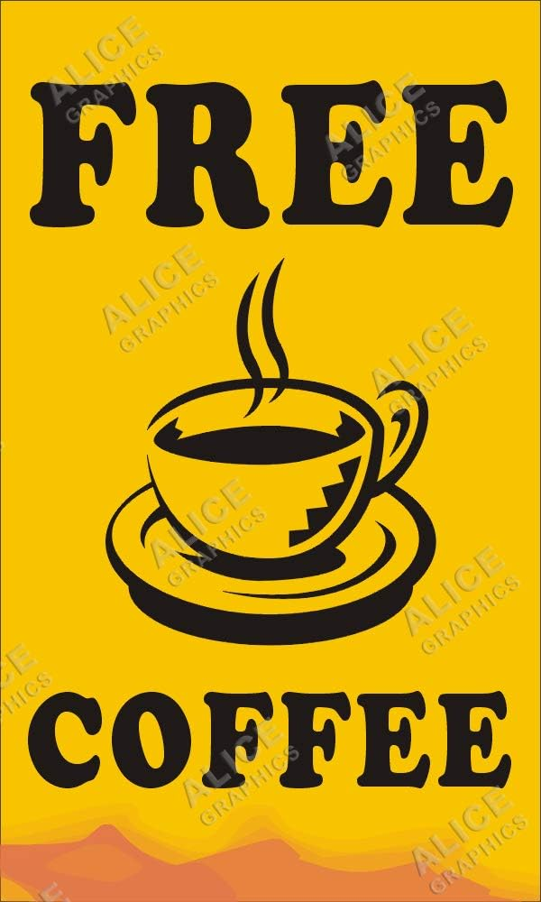

<figure>

<figcaption>

Free coffee cup indeed, but no coffee.

</figcaption>

</figure>

Well for the second week in a row, PBX pre-blasted that The Green Mile needed a Q and whoever took the reigns would be the proud owner of a brand new F3 stainless steal coffee mug! Well, YHC loves coffee. And free stuff, so even though I'm tapering for the TRM next Saturday, I figured a little 90 minute bootcamp wouldn't hurt anything. So YHC jumped on the Q sheet and is now the proud owner of said coffee mug. Here's what we did to earn it.

**Warmup**: 5 Pax gathered at the flag with no FNGs so pledge, mission statement and off we go. Mosey up the driveway, down Roberts Rd, Right on Green Level and then Right into the driveway that leads to the bus parking area and a lap arounnd the buses to get us to 1 mile to start. Circle up for:  
SSH x 15 IC  
Good Mornings x 5 IC  
Sir Fazio Arm Circles x 10 IC  
Seal Claps x 10 IC  
Imperial Walkers x 10 IC  
Plank Jacks x 10 IC  
Calf Stretch L/R x 10 silent count each side

**Thang 1:** Everyone go grab a cinder block from the cinder block storage area, behind the water treatment area. Rifle carry your block back to the parking lot. 10 rounds of: 5 man makers, 10 block rows, 15 curls and then a lap around the pickle. Thanks to PBX for hanging in the back with me while Biner and the rest of the bat flippers ran away. Return the blocks and then head back to the cars for a little water break. (Admittedly, Schlitz may have had his water to beer ratio off the day before and was a bit thirsty)

**Thang 2:** "The Pain Train" (courtesy of Lookout). Lineup at the stop sign and mosey to the next mulch bed for 5 merkins. Mosey back to the start and head back again stopping at the first bed for 5 more merkins and then carry on to the next for 10 Big Boy Sit-ups. Head back to the start stopping again for 5 merkins on the way. Carry on in that fashion with 15 star jumps, 20 Steve Earles and finally 25 LBCs IC. Every time you pass a bed, you perform the number of exercises associated with that bed.

**Mary**: 6 minutes of Mary including E2K, Dying Cockroach, Shakiras, Jennifer Lopez, American Hammer, Heels to Heaven, all x10 IC. YHC led a few stretches before passing off to Hi-Liter to finish us off. TYFYL.

**COT**: 8 Pax, 5 BC, 3 Bad-@$$ Motherruckers. TCP Sawgrass this Sunday. Sooey is "site Q" for Western Wake Ministries food pickup at Lowes Foods every Saturday. There's a slack channel to get signed up. Prayers for those of us running the full and half marathons next weekend. Prayers for those in recovery. YHC took us out in a BOM.
