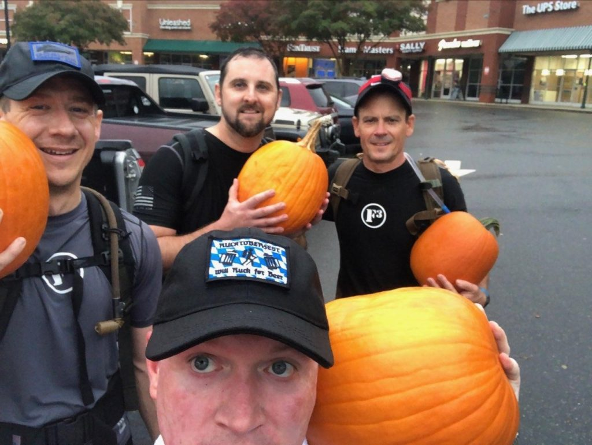
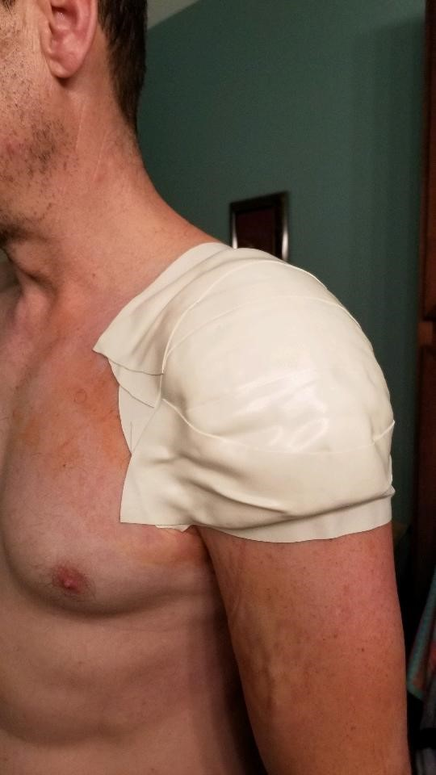
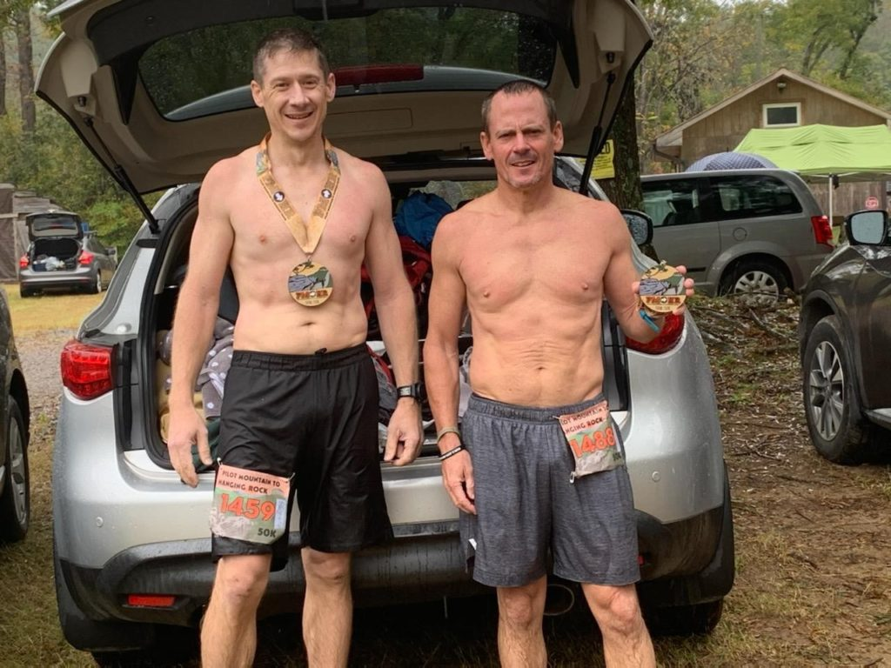
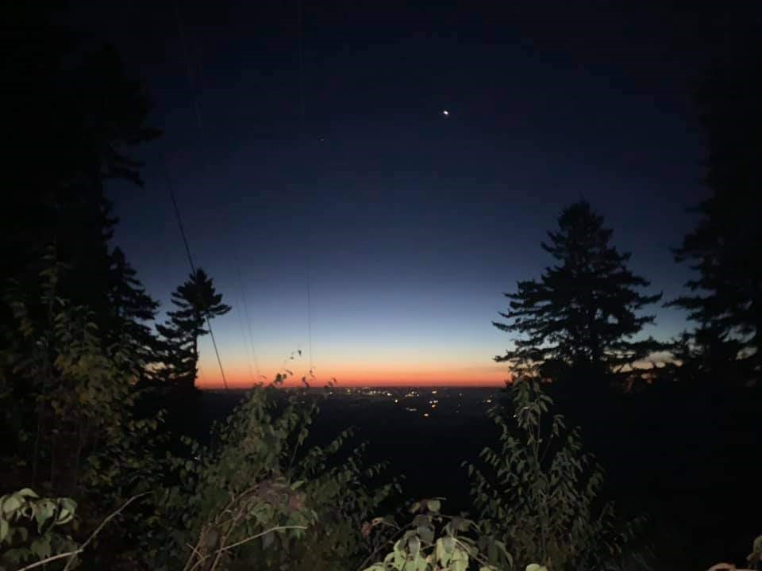
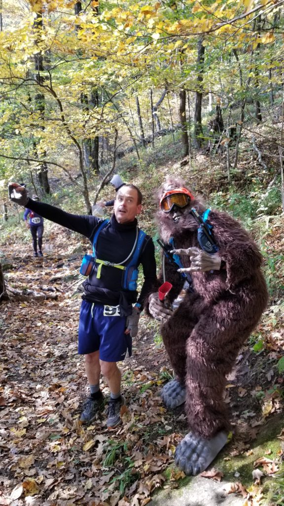
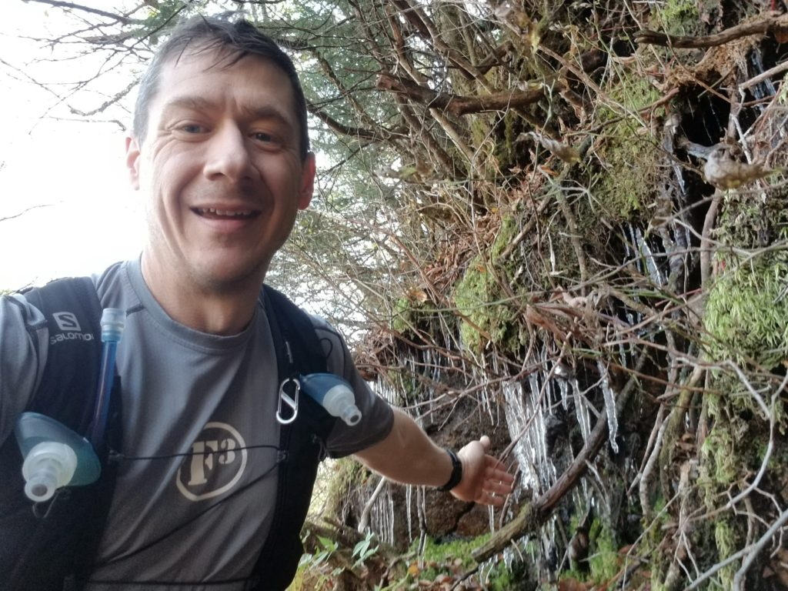
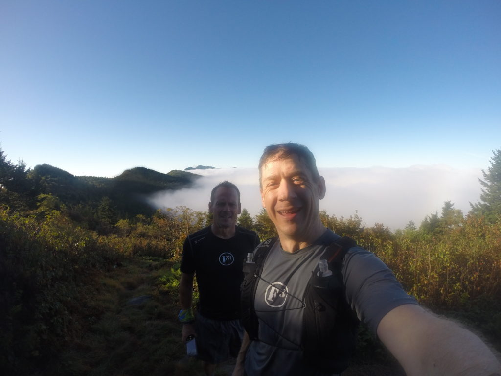

YHC: "Hey Banjo, I'm going to run a really nasty 50k trail race, you in?"

Banjo: "Uhhhh, no, not really. What race? 50k, what is that, 31 miles? I'm not sure I ......"

YHC: "Well, we have to also run another 50k trail race within their cutoff first just to qualify"

Banjo: "Two 50k's??? I've never even run a marathon...."

YHC: "There's also a 10,500' elevation gain, and you have to carry a water filter so you don't die."

Banjo: "IN!"

This is roughly how "Do Epic Shit 2020" got started while completing the GoRuck October 2019 "Pumpkin Ruck" workout. There's much more backstory, and it's all better shared over beer or coffee. In short, you only get so many trips around the sun, and you never ever know how many remain, nor of those how many you'll really be able to do what you enjoy physically. With that in mind, I determined to pick an event each year to stand out, to set it apart, make memories and despite whatever else may go down....make THAT year epic in some way.

After the discussion above, we settled on a qualifying run (the choices were extremely limited) and then I found an online 50k training plan and realized we were already at week 4!!! Fortunately we were already running those mileages, so no big deal. So, in the span of a couple weeks, I signed up for the Quest for the Crest 50k, the South Mountains Ultra 50k, the Uwharrie 20-miler, and the Tobacco Road full marathon. WTF have I gotten myself into??

1st up was the South Mountains Ultra held at South Mountains State Park just south of Morganton, NC on January 11th. The hardest part about this was doing those long runs Saturday mornings. It was cold, it rained, it was cold AND raining, and it was always dark. We got good at running in the darkness of Umstead MUT's and no headlamps. We got REAL good at it. We also crushed the SoMo Ultra, coming in at 6:40 and 7:20, well ahead of our qualifying cutoff times. It was also about this time that my shoulder began to really bother me. Better get that checked out..... busted Rotator Cuff. Perfect. Surgery recommended....Crap!

I rolled right into Uwharrie, and figured COVID would cause the Tobacco Marathon to cancel, or my surgery would get scheduled just before it and I'd have to defer anyway. I stopped training, and of course surgery was scheduled for March 17th, four days after the Tobacco Marathon, which I ran virtually with the greatest team ever: F3 Carpex!

Shoulder surgery is apparently known for a painful, lengthy recovery. I'm talking 10+ weeks of no running. Doing a pushup is more like 16 weeks, and unassisted pullups - 9 months. There's no way I can run the Quest for the Crest in May. But, 2020 gonna 2020, ya'll! Quest for the Crest gets rescheduled to October 17th! Hell yes! I'm back in the game! I think.

Anybody venture a guess what's worse than getting in shape? Getting **BACK** in shape, especially during the North Carolina summer with the heat and 99% humidity. I could barely run again in mid June. It was painful, but I could run. A little. I opened up my Ultra Trainer Spreadsheet and realized I had a paltry few weeks to get back up to 6 miles before life got really tough. Fast forward through a few Maynards, hundreds of sweaty miles in Umstead, dehydration at Uwharrie, a soaking at BRR, a severely bruised rib, and we arrive at the Pilot Mountain to Hanging Rock 50k on Oct 10th. (Oh, I found this race last October and thought it looked cool, so I convinced a few other HIDAs to sign up for it too.) And if you're keeping track, that's one week out from the Quest for the Crest! Sounds like a stupid taper, right? Exactly. That bruised rib had been healing for two weeks and felt like a persistent side stitch for the whole race. I didn't come this far just come this far, so I'm not letting that stop me. With the Quest coming up, I took it pretty easy in the PM2HR race. Enjoyed the scenery and tried to just not get hurt any worse.

Shortly after PM2HR we received an update from the Quest Race Director, Sean "Run Bum" Blanton that our mandatory gear list had increased from just a water filter, to now also include a hat, gloves, insulated top, windbreaker, and headlamp for the entire race. The weather forecast was now calling for 22 degrees atop the Crest Trail and winds exceeding 30mph. Well That's Fantastic.

Fortunately, it wasn't quite THAT bad on race day, but it was cold, that's for sure! We had a 0515 start time with time cutoffs for the three aid stations at miles 13, 26 and 33. It was about 35 degrees when we started near Black Mountain Campground. Despite being split into waves, everyone started together, all 120'ish of us. Banjo and I took advantage of the 3/4 mile gravel road to get ahead of as many folks as practical before getting on the single track trail going up Mt Mitchell. This proved to be probably one of the wisest things we did, as we maintained pace all the way up with very little jockeying for position. Two or so hours later near the top, we were presented with one of the most spectacular views I've ever seen. Stars in the sky, including a very visible Milky Way along with an orange glow on the horizon. This pic doesn't begin to do it justice, and is substantially brighter than it really was.

I rolled into AS#1 (Mile 13) hoping to be there by 10:00am. I asked the volunteers for the time and was very pleasantly surprised to hear it was almost 9:00am. Wow! I quickly did some math and realized a 10-hr time was realistic in this race with a 14.5hr maximum cutoff. I was pumped!!! Banjo popped into the AS shortly after me and quickly made quite a show for all the ladies present! You'll have to ask him for those details. After loading up, I headed out.

The second trip up Mitchell is via the Buncombe Horse Trail and begins with a couple miles of relatively flat, and fun running through the woods, crossing streams along the way. Then, it starts going up, and it doesn't stop for about four miles, just getting steeper as it goes. There was a surprise Aid Station at the half-way point....

I hit a wall of sorts once we reached the top, and mosey'd / walked my way the next couple of miles then began running again in earnest as the slow downhill started. Some perspective here, this was about mile 20 on a trail we ran before sunrise, and now we could see the icicles. It was in the low 40's now I guess, and they were melting, but gave a real perspective to how cold it was earlier.

The downhill started about mile 21. and it was a very gradual downhill here that continued in that manner to the next aid station at mile 26. This aid station was a short out-and-back from a turn in the course. Banjo had run ahead of me and was returning from the aid station when I got there. He said "Dude, you're 20." I was a bit confused and had no idea what he meant, so I asked him to repeat himself. He replied "If you keep your position from here on out, you'll finish in the top 20!" Now, for this entire race, I just wanted to finish. I did not care in the least what place I was.....until now. I determined then that I was finishing top 20! When I got to the aid station, two guys were there still filling stuff and eating. I loaded up and hit the trail while they were still there. #18 now. Remember, I'd already been running a gradual downhill for about 5 miles, but from the aid station on, it got pretty steep! I downhill well, and caught a guy after about 2 miles. 17th now. I was getting tired, and kept looking at my watch telling myself I could hang in another half mile. Then another. Then another. Then another. Wait, exactly how damn long is this downhill??!! Turns out, it was a little over eight miles of downhill, and I made pretty good time on it.

Aid Station 3 was at about mile 33, only 2.5 miles to go. No one visible in front of, nor behind me. I got two pickle slices and two shots of coca-cola then headed out. The downhill was (thankfully) mostly over, and this piece of trail offered a somewhat refreshing rolling mix that included a 600' elevation gain. About half way through, another runner (Cliff) caught up to me and said "Dude, if we push it, we can beat nine!" Nine....what? What the F is he talking about??!! He then explained that we only had a mile or so to go, and if we pushed would finish in under nine hours. Again, I originally just wanted to finish, and at AS1 thought 10 hours was reasonable. I had not checked my elapsed time at all during the race. But now that I knew I was on the cusp of finishing in nine hours.....I was finishing in nine hours! Cliff and I finished 17th and 18th respectively, with him about 45 seconds in front of me. 18th place overall in 8:58. Not too bad, I'll take it. I felt great. No cramping, and I was still energetic. In fact, I felt more energetic than I did a week before after the PM2HR race!

<figure>

<figcaption>

DCIM\\104GOPRO

</figcaption>

</figure>

My year of training all culminated in this finish. Simultaneously happy and sad that it was over. It was awesome, and I look forward to the next challenge! I want it to top this one, and if it doesn't, that's just fine. Maybe I'll run this one again. I'd be ok with that. But, I do know what the next challenge is already.

Many of you know that while in the Air Force, as part of flight screening the Dr's determined I had Mitral Valve Prolapse, a condition that causes a murmur in the left ventricle/aorta. The vast majority of folks with MVP will never know it. The ones who do find out only when it's very symptomatic and the damage is irreversible. I'm fortunate. I knew it before there were any issues. In March, I had it checked for the first time in 18 years, and the results were....I need surgery. Open Heart surgery to repair my leaking valve. Further tests confirmed this in June, and in early September, I met with the surgeon for the second time and established November 18th as the surgery date.

The surgery will take 2-4 hours and is as routine as open-heart surgery gets. I will wake up and hour or so after surgery in the ICU and remain there about a day. Then I move to a regular recovery room for another 3-5 days where I'm told I will get no rest. They clearly have no idea what it's like to get back in shape and run two back-to-back 50k's in four months! My first week home will be the week of Thanksgiving, and I'm to take it easy that week, lots of naps. Perfect.

Week two out of the hospital I'm supposed to go for long walks, 3+ miles and mostly focus on taking deep breaths, heart rate in the 100's. The heart is one of the fastest healing things in your body, and it will be mostly healed before I even leave the hospital. The surgery will be robotically assisted and minimally invasive, and access will be through my right rib cage, which does NOT heal quickly. So. breathing will be painful. No worries, remember that deeply bruised rib I mentioned? Every breath has been painful for the last three weeks! No problem, just more training.

Week three home from the hospital, I'm good to run and just need to keep my heart rate below 140 average.

6-8 weeks after surgery and life will be mostly back to normal, but getting back to peak physical performance will take the better part of a year.

So, who's running the 50k next September with me? Table Rock 50k the week after BRR, I'll be your training partner, and if I can do it, so can you. Your excuse is invalid. I'll see you in the gloom.
