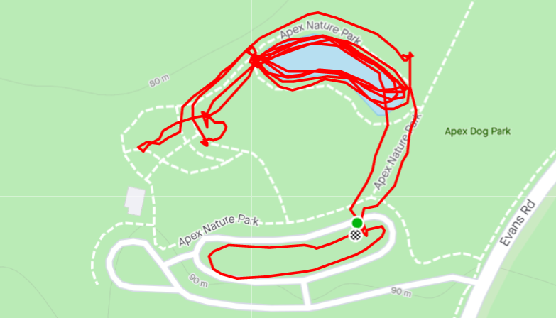

**Workout Date:** 05/15/21  
YHC has never posted Piranha Park, but as I am stepping up my Carpex Qs, I figured a standard one hour Saturday workout would be a great start.

**Warm Up:**  
Check for FNGs, give the mission statement, give the disclaimer, and warm up:  
Side Straddle Hop x20 In Cadence (IC)  
Good Morning x10 IC  
Imperial Walker x20 IC  
Sir Fazio Arm Circles x10 IC Forward x10 IC Reverse  
Monkey Humpers x10 IC  
Standard Merkins x10 On My Down (OMD)  
Mountain Climbers x10 IC  
Downward Dog with calf isolation stretches  
World’s Greatest Stretch

**Main Event**  
**1)** **Mosey** around the pond and through the amphitheater to survery the AO. The pond looked really cool with the fog and mist in the early morning. Mosey back to the amphitheater side of the pond.  
**2)** Partner up for **Dora** around the pond. **100 Merkins, 200 LBCs, 300 Squats**.  
**3)** **Squirrel crawl** along the amphitheater walls  
**4)** **10-15-10 pyramid** on the amphitheater walls of: **Left-Right Step Ups, Irkins, Dips, Elevated LBCs, Derkins**  
**5)** Mosey to other end of pond to the rocks, see the bunnies, and grab a rock for another **10-15-10 pyramid: Curls, Triceps, Overhead Press, Bent Over Rows**. Return rocks and back to start.  
**6)** With same partner, **BALLS** around the big parking lot pickle. One partner stays and does exercises. The other partner runs across the parking lot and back. Flapjack. Based on time, call an audible to cut normal reps in half. Just enough time for one lap each partner.  
Half-BALLS Exercise Circuit: (everything single count)  
**B**urpees x5  
**A**merican Hammer x10  
**L**unge x15  
**L**BC x20  
**S**quat x25

<figure>

<figcaption>

[https://www.strava.com/activities/5301539099](https://www.strava.com/activities/5301539099)

</figcaption>

</figure>

**Mary:**  
Various. Dolly, Freddy Mercury, Flutter Kicks, Homer To Marge, others I can’t remember. All x20 IC.

**COT:**  
4 PAX  
Announcements: Carpex Park/Highway Clean Up is coming soon, Blood Drive 5/15 at Alexander YMCA, F3 Wendell on Saturdays (Shark Bait is Q this week), Iliad 5/22, El Duce’s Recovery on the Run 6/12, F3 Day of Service 6/19  
Prayers for those dealing with suicide attempts, job struggles, brain tumor recovery, parental health. Other prayers unspoken.  
YHC took us out

**Naked Moleskin:**  
Piranha Park has a lot of options. Great park with great scenery. The mist evaporating off the pond was beautiful. The best setting for Dora I’ve come across.  
It was a small group but that made fellowship ridiculously easy.  
75% attendance for coffeteria afterwards.  
This was my forty-fourth #F3Q21 #2021Challenge Q. Next Q is Tuesday at Full Metal Jacket in Carpex.  
\-Pigpen

**QIC:** Pigpen  
**PAX:** Old Maid, Peeping Tom, Pigpen, Queequeg  
**Workout Date:** 05/15/21
