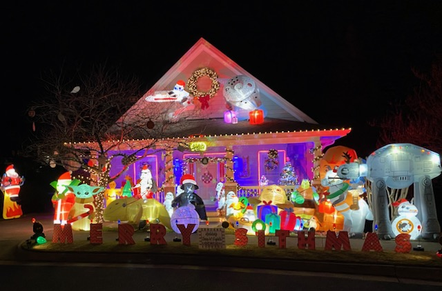

The Q for Lion's Den remained unfufilled and I hadn't Q'd on the home turf in sometime so I took the opportunity. 10 Pax gathered at the flag with no FNG's although with the winter gear on some were more distinguishable than others. A quick pledge and we're off.

## Tour of Lights Mosey

I had promised Coxswain a view of my neighbor's Star Wars Christmas display as a perk to coming to Lion's Den earlier in the week on Slack, alas he picked up the Q at Point Break so wasn't with us -- I decided to go through with the tour anyhow. A colder morning calls for an extended warm up anyway. Theismann didn't realize he needed to start his Strava, I still need to go back and tag him so he gets credit.

There was some mumble grumbling about lack of lights on the tour, then I hit them with this:

## Warm Up

- 40 ssh
- 30 Imperial Walkers 
- 20 Sir Fazio ~ 5 Each Front / Back / Big / Small
- 5 Good Mornigs
- Calf stretch
- Runner stretch

Another Short Mosey back to the portico at the side of the church

## ME: 12 Days of Christmas

Just like the song this started out with 1 exercise performed one time and built on that each round as follows with a lap around the pickle between each.

1. Turkish getup
2. Foxhole - WWI, roll to the side into a Merkin.
3. Star Jumps
4. Crab Cakes
5. Burpees
6. Reverse Lunges
7. American Hammers
8. Merkins
9. Shoulder taps
10. Monkey Humpers
11. Freddy Merc's
12. Sumo Squats

## Mary

- 15 Nolan Ryans each side
- 30 LBC
- 15 heels to heaven 
- 5 control freak homer to marge

Have a nice Day

## Announcements

- Oakwood 24 this weekend - get out and F3 Raleigh’s own **Jon Frey** ([@FreyDaddy](https://twitter.com/f3freydaddy))
- Duck Donut Dash - Feb 4th Register by Jan 4th to get a shirt

## Prayers

Disco Ducks M and Family at the loss of his MiL

Kermit's co-worker who fell off a ladder yesterday - miraculously minimal injuries

Blue and Outs good friend, co-worker, and ED nurse who has COVID and is in the hospital for treatment

YHC took us out.
